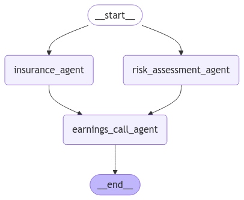

# Agentic workflow for a car insurance company with LangGraph and PGVector

## Intro
The following is an exercise in agentic workflow for a fictious car insurance company.

Main features:
- It uses LangGraph to orchestrate agents and LangChain to load helper components
- It leverages a vector store, in this case a PGVector store created with [Neon](https://neon.tech). A free account suffices for the purpose of validating the exercise.

## Setup
- Required dependencies are specified in Poetry. Existing requirements.txt file for pip has been removed to avoid confusion.
- We need to define 2 environment variables for the example to work:
* `NEON_CONNECTION_STRING`: to connect to the PGVector DB in Neon
* `OPENAI_API_KEY`: to get embeddings for document chunks and perform LLM inference

## Agentic workflow
- For the purpose of illustrating a multi-agent workflow or agent pipeline, we have created 3 different agents:
* `InsuranceAnalysisAgent`: it produces a market analysis from a user query, leveraging existing data in the provided documents under `iii.org`.
* `RiskAssessmentAgent`: it produces a risk analysis from a user query, leveraging internal model knowledge (one could easily imagine using a fine-tuned version for this agent or an additional vector store).
* `EarningsCallAgent`: it produces an earnings call report based on the market analysis and risk assessment data from upstream agents, plus information of previous earnings call (stored in memory for simplicity in this example).

Here is the agent graph:

The most important aspect of this diagram is the parallel nature of the `insurance_agent` and the `risk_assessment_agent`, and the recombination of both results before proceeding with the last step of the workflow with the `earnings_call_agent`.

This is representative of more complex flows, where agents have a dependency graph and need to be orchestrated accordingly. In this case, we use LangGraph for such orchestration.

## Assignments

The original assigments were:
* Task 1: Complete the Document Pipeline -> implemented in `DocumentProcessor`
* Task 2: Implement Vector Store -> implemented in `VectoStore`
* Task 3: Create Analysis Agent -> implemented in `InsuranceAnalysisAgent`

Additionally, new agents, additional dummy stores, and parallel flow have been implemented.

## Running the example

Run the example as follows:
1. Clone the repo
1. Set up the environment, using poetry (`poetry install; poetry shell`)
1. Create a DB in Neon.tech, copy the connection string and set it in the `.env` file.
1. Copy you OpenAI API key in the `.env` file.
1. Run the agent workflow as follows.

`cd src; python main.py --debug --query "<your_natural_language_query_over_car_insurance>" --docs-dir ../iii.org`

The first time the script runs, the documents are chunked and stored in the PGVector DB. This is only done once.

You can find sample outputs in the `output` directory.

## Sample output

Here is one output sample for convenience:

**Query: What's the trend in auto insurance costs over the last 3 years?**

**Answer:**
## Earnings Call Report - AutoGuard Insurance Inc.

### Market Analysis:
The trend in auto insurance costs over the last 3 years shows a steady increase:
- In 2010, the average expenditure was $792.
- In 2011, the average expenditure increased to $798, showing a 0.8% increase.
- In 2012, the average expenditure further increased to $815, indicating a 2.1% rise in auto insurance costs.

### Risk Assessment:
When assessing the trend in auto insurance costs over the last 3 years, several risks need to be considered:
1. **Market Trends:** Fluctuations in the overall economy, changes in consumer behavior, and shifts in the competitive landscape can impact auto insurance costs.
2. **Regulatory Environment:** Changes in regulations can directly impact insurance costs.
3. **Claims Frequency and Severity:** The frequency and severity of auto insurance claims significantly impact costs.
4. **Underwriting and Pricing Strategies:** Changes in underwriting criteria and pricing models can impact insurance costs.
5. **Catastrophic Events:** Natural disasters can have a significant impact on insurance costs.
6. **Technological Advancements:** Adoption of new technologies in vehicles can influence insurance costs.
7. **Fraud and Claims Management:** Fraudulent claims can lead to increased costs.

### Recent Financial Highlights:
#### Q3 2024:
- Net income: $180 million, up 15% from Q3 2023.
- Revenue: $1.4 billion, up 12% from Q3 2023.
- Combined ratio: 93.5%, down from 95.1% in Q3 2023.
- Policyholders' surplus: $3.1 billion, up 18% from Q3 2023.

#### Q4 2024 (Preliminary Results):
- Net income: $200 million, up 20% from Q4 2023.
- Revenue: $1.6 billion, up 15% from Q4 2023.
- Combined ratio: 92.2%, down from 94.5% in Q4 2023.
- Policyholders' surplus: $3.3 billion, up 20% from Q4 2023.

### Strategic Initiatives:
- **Digital Transformation:** 75% of customers now interact through digital channels.
- **Data Analytics:** 20% reduction in claims frequency and severity through advanced analytics.
- **Expansion:** Entered 10 new states in 2024, with plans for 5 more in 2025.

### Guidance:
- Full-year 2025 net income expected to be $800-$850 million.
- Full-year 2025 revenue expected to be $6.2-$6.7 billion.

### CEO Comments:
- Pleased with Q3 and preliminary Q4 results.
- Strong growth in personal and commercial auto lines.
- Commitment to strategic initiatives for long-term success.

By analyzing market trends, risks, and recent financial performance, AutoGuard Insurance Inc. is well-positioned for continued growth and profitability in the auto insurance industry.
